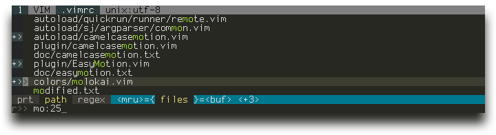
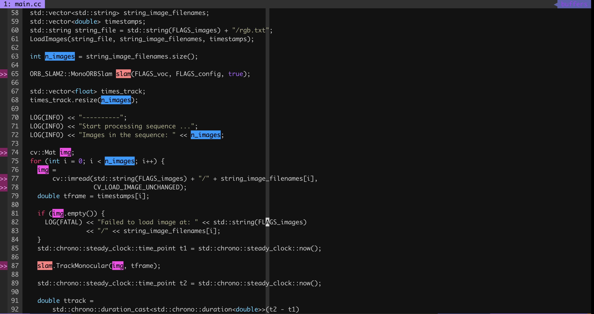
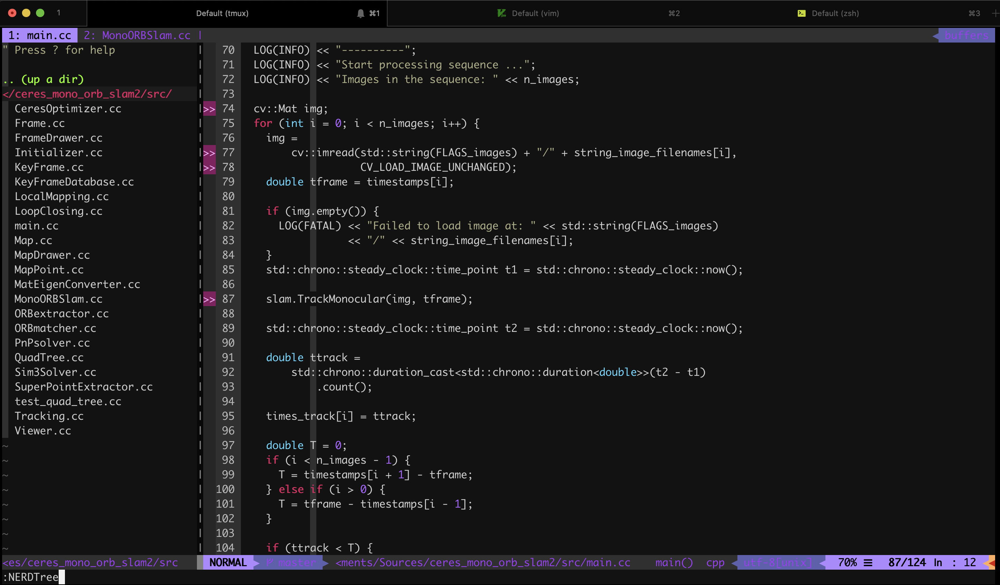
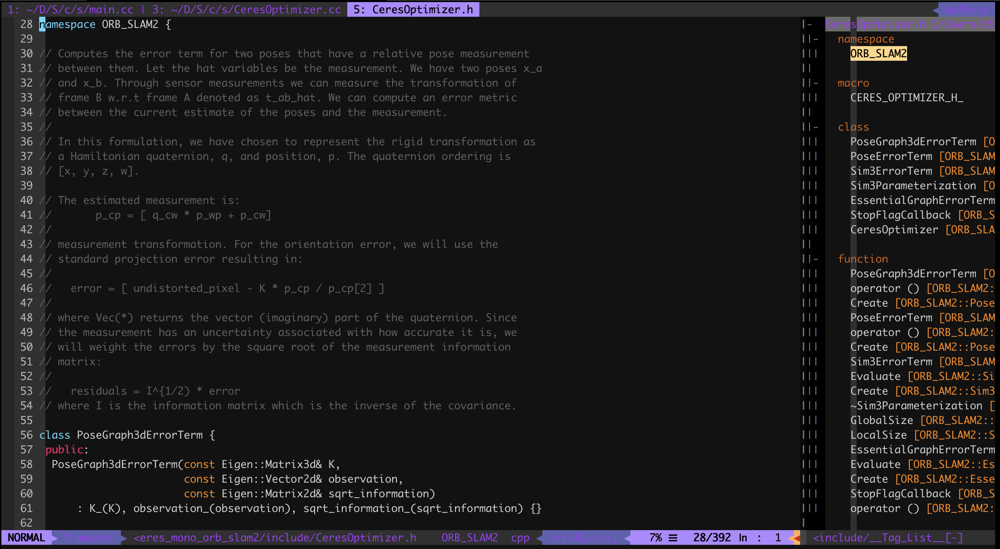

# My Vim Configuration

Include .vimrc, ctags, cscope, jedi and pathogen settings

## Installation
This script will cp .vimrc and install vim plugins to your $HOME directory

```bash
$ git clone https://github.com/b51/ConvenientTools
$ cd VimSettings
$ ./setup.sh
```

You may want to modify author_name and author_email at line 62, 63 in ~/.vimrc after installation


## Plugins Usage Introduction

以下说明根据有用程度排序
Sorted with most useful top

### YouCompleteMe

Reference: https://github.com/ycm-core/YouCompleteMe

```bash
功能: 高级自动补全功能, 如下图所示
启用: 该功能一定要编译YouCompleteMe (在setup.sh 已经执行过了), 若没有编译成功则补全不会自动弹出
      若没成功则可参考手动编译方法
$ cd ~/.vim/bundle/YouCompleteMe
$ python3 install.py --clang-completer
快捷键: ctrl + 'p', ctrl + 'n' 上下选择补全

Function: Auto complete for C/C++, python
Enable: Auto complete should enabled after compiled YouCompleteMe (alread done in setup.sh),
        if failed, manual compile is recommended as ilustrate below
$ cd ~/.vim/bundle/YouCompleteMe
$ python3 install.py --clang-completer
ShortCut: ctrl + 'p', ctrl + 'n' to switch in auto compelet candidates
```

<div align="middle">
  
</div>

### Ctags

Reference: https://courses.cs.washington.edu/courses/cse451/10au/tutorials/tutorial_ctags.html

```bash
功能: 跳转到函数定义，即便是在不同文件/不同文件夹内也能跳转
启用: 该功能需要先安装 exuberant-ctags (setup.sh 内已安装), 并且需要先在 repository 文件夹中生成 tags 查找文件,
      然后就可以在函数上按 ctrl + ']' 跳转到函数定义, 然后 ctrl + 't' 返回, 可以多次跳转
$ cd YOUR_SOURCE_ROOT_DIRECTORY
$ ctags -R *
$ ls tags
快捷键: 在函数或变量上按 ctrl + ']' 跳转到定义, ctrl + 't' 返回

Function: Jump to definition of function/variable, even definition not in the same file
Enable: exuberant-ctags is necessary to enable this function (alread installed after launch setup.sh),
        and a look up table file "tags" should be generated before usage with command below
$ cd YOUR_SOURCE_ROOT_DIRECTORY
$ ctags -R *
$ ls tags
ShortCut: Press ctrl + ']' on function/variable jump to definition, ctrl + 't' return, can jump recursively
```

### Ctrlp

Reference: https://github.com/ctrlpvim/ctrlp.vim

```bash
功能: 快速打开同一个目录(如果该文件在一个git下, 那么就是在同一个git repository下查找)下的文件
使用: 在非insert模式中输入 ctrl + 'p', 然后输入想打开的文件名(可以是关键字), 就可以快速定位到该文件
快捷键: ctrl + 'p' 启用, ctrl + 'j' 向下， ctrl + 'k' 向上, 回车打开， ctrl + 'v' 分屏打开

Function: Search a file with name in the same directory/repository, and open it
Usage: press ctrl + 'p' in normal mode, this will open a search window, and you can search file with name
ShortCut: ctrl + 'p' to enable, ctrl + 'j' goes down, ctrl + 'k' goes up, open with enter,
          ctrl + 'v' open in split screen
```

<div align="middle">
  
</div>

### VimMark

Reference: https://github.com/inkarkat/vim-mark

```bash
功能: 高亮多个关键字, 如下图所示
启用: 在想高亮的字上顺序按下 '\' 和 'm'
快捷键: 顺序按下 '\' 和 '*' 可以搜索该高亮关键字

Function: Display functions/variables in current file on the right
Enable/Disable: 'F8'
ShortCut: 'j', 'k' move down and up; enter goto function/variable
```

<div align="middle">
  
</div>

### NerdTree

Reference: https://github.com/preservim/nerdtree

```bash
功能: 在左边显示文件列表, 如下图所示
使能: 在vim中输入':NERDTree'
快捷键: 'j', 'k' 控制上下移动, 'u' 返回上层文件夹, 回车打开文件/文件夹, 's' 以分屏方式打开文件

Function: Display files tree on the left
Enable: ':NERDTree'
ShortCut: 'j', 'k' move down and up; 'u' go to upper director; enter open file/dir,
          's' open file with screen split
```

<div align="middle">
  
</div>

### TagList

Reference: https://github.com/vim-scripts/taglist.vim

```bash
功能: 在右侧显示本文件内函数及变量名, 如下图所示
启用/关闭: 按键'F8'
快捷键: 'j', 'k' 控制上下移动, 回车转到相关函数/变量

Function: Display functions/variables in current file on the right
Enable/Disable: 'F8'
ShortCut: 'j', 'k' move down and up; enter goto function/variable
```

<div align="middle">
  
</div>

### GoogleCodefmt

Reference: https://github.com/google/vim-codefmt
[Google C++ Style Guide](https://google.github.io/styleguide/cppguide.html)

```bash
功能: 自动规范代码格式为 google c++ style
启用/停用: 在 vim 中输入':AutoFormatBuffer'/':NoAutoFormatBuffer', 启用之后会在每次保存(':w')的时候自动规范代码
           若只想规范一部分, 那么使用 shift + 'v'(即大写'V') 选中想要规范部分，然后输入':'<,'>FormatLines'
           (选中片段后按下 ':' 会自动出现 ':'<,'>, 这时候只需要输入 FormatLines 就行)

Function: Auto format code to google c++ style
Enable/Disable: ':AutoFormatBuffer'/':NoAutoFormatBuffer', after enabled, codes will be auto formatted after each
                save with ':w'. If only format part of file, can select on parts with shift + 'v', then press
                ':' and input 'FormatLines'
```
